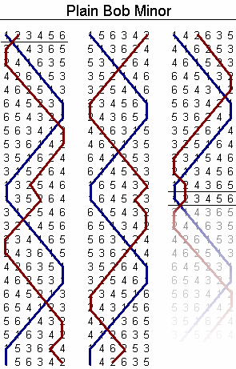

[Change ringing](https://en.wikipedia.org/wiki/Change_ringing) is a
technical and musical pursuit involving the ringing of bells (typically
large bells as found in church belltowers, but sometimes handbells
or electronic bells).

Churches in England historically used large bells to alert citizens or
to call them to the church to worship. The sound from these large bells carries
much further when they are pointed horizontally, so that's the ideal
orientation for a bell strike. The ideal number of bells, similarly, is "lots!".
But when you've got lots of huge bells, and you and some of your good friends start
ringing them willy-nilly, the resulting sound is more "cacophony" than
"enticement".

You could ring the bells in melodies, by striking them as they hang freely, but
then you lose the benefit of bells swinging from side to side, projecting in
all directions. You could *try* to ring them in a melody the ordinary way,
but you'll find that the possible melodies are quite restricted by the bells'
periods: You can't very well stop and start bells at will (by virtue of their
weight).

So instead, the English rang in "changes": bell orderings that move bells
around by small amounts. For example, if you number each bell `1 2 3 4` from
the smallest (highest, referred to as the "treble") to largest (lowest, or
"tenor"), the following set of changes is known as "plain hunt minimus":

```
1 2 3 4
2 1 4 3
2 4 1 3
4 2 3 1
4 3 2 1
3 4 1 2
3 1 4 2
1 3 2 4
1 2 3 4
```

## Change Ringing Notation

These changes are specified in a number of ways: the primary way to
show a "method" (a set of changes meeting some mathematical requirements)
is using a "blue line" diagram like this one:


Another way is by using something called "place notation", wherein
the "unswapped" bell positions in a row are listed. If a row swaps
all bells, it's represented by an `x` or a `-`. If necessary to avoid
ambiguity, rows are separated by `.`s:
Plain Bob Minor is described in place notation as `x16x16x16x16x16x16x12`.

There are some ways to write methods using shorthand versions of place notation,
but to be honest I'm pretty new at this and haven't learned them all.

# Personal History

I first learned about change ringing from my cousin, who lives in Boston.
She's a member of the [MIT "guild"](http://bellringers.scripts.mit.edu/www/)
of change ringers, who ring the bells in
[Old North Church](http://oldnorth.com/) (famous for being the tower
from which "one if by land, two if by sea" lamps were set prior to
"Paul Revere's Ride" (Revere having been a bell caster)), and
[The Church of the Advent](http://www.theadventboston.org/).

Being Jewish, my cousin initially got interested in bell ringing through
an interest in the history of Old North rather than any religious affiliation,
and I've found this to be typical: Most change ringers I've met are united
through an interest in mathematical patterns, rather than any sort of
piety. Everyone I've met through change ringing is incredibly smart (and
typically very good company, if you're mathematically inclined).

When I was in Boston for an internship, I started going to tower practice
twice a week with this group, and had a blast. It's a somewhat difficult
skill to acquire: You need some physical prowess (though not much strength)
and a lot of practice holding patterns in your mind.

I continued ringing the following summer in Pittsburgh, though less
frequently since the tower was much less convenient.

And now that I'm in the San Francisco Bay Area, there are no towers at all.
I've been practicing with a small local group of ringers, on handbells. We meet
once a month in San Jose, which isn't really enough practice to get good at
anything, if I'm honest.

This brings me to the next section:

# Tintinnabulation

I've been working on a project to practice ringing bells. You can
see [its code](https://github.com/benwr/tintinnabulation) or [play
with it on the web](http://benwr.net/tintinnabulation). Right now
all you can do is specify a method in place notation, and have
your browser play it.

The goal is to turn it into a web-based version of
"[Mobel](https://itunes.apple.com/us/app/mobel-bell-ringing-simulator/id398901131?mt=8)",
a bell practice app that only works for iPhone.

Right now it consists of two major components: The place notation
library (dumb javascript algorithms for expanding place notation),
and the UI. The UI at least will need to be totally scrapped
if I'm going to build the final version of the app.
